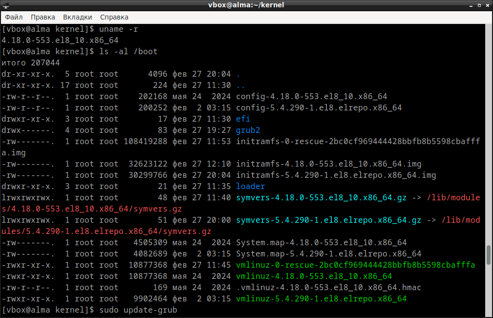
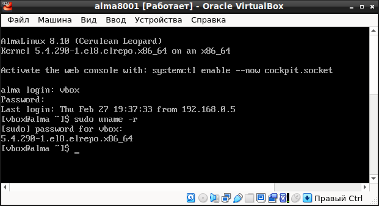

# Домашнее задание по курсу "Administrator Linux. Professional"

**Название задания:** 

  - Запустить ВМ c Ubuntu. 

**Текст задания:** 

  - Обновить ядро ОС на новейшую стабильную версию из mainline-репозитория. 
  - Оформить отчет в README-файле в GitHub-репозитории. 

**Дополнительное задание** 

  - Собрать ядро самостоятельно из исходных кодов.

## 1. Обновляем ядро OC на новейшую поддерживаемую весию (Ubuntu 20 LTS)
   
 - Проверяем текущую версию ядра: 
 
`uname -r` 

>5.4.0-205-generic

 - Определяем архитектуру процессора:

`uname -p` 

>x86_64

 - значит, архитектура amd64

2.  Определяем подходящую версию ядра:

на сайте https://kernel.org/ ищем последнюю поддерживаемую версию ядра, которая начинается с 5: 5.15.178 \
на сайте https://kernel.ubuntu.com/mainline/ заходим в репозиторий v5.15.178, \
далее заходим в amd64/, правой кнопкой мыши копируем ссылки, начинающиеся с linux-, скачиваем через wget: 

```
mkdir kernel && cd kernel    
wget https://kernel.ubuntu.com/mainline/v5.15.178/amd64/linux-headers-5.15.178-0515178-generic_5.15.178-0515178.202502230832_amd64.deb
wget https://kernel.ubuntu.com/mainline/v5.15.178/amd64/linux-headers-5.15.178-0515178_5.15.178-0515178.202502230832_all.deb
wget https://kernel.ubuntu.com/mainline/v5.15.178/amd64/linux-image-unsigned-5.15.178-0515178-generic_5.15.178-0515178.202502230832_amd64.deb
wget https://kernel.ubuntu.com/mainline/v5.15.178/amd64/linux-modules-5.15.178-0515178-generic_5.15.178-0515178.202502230832_amd64.deb
sudo dpkg -i *.deb
```
>**dpkg**: зависимости пакетов не позволяют настроить пакет linux-headers-5.15.178-0515178-generic: \
>linux-headers-5.15.178-0515178-generic зависит от libc6 (>= 2.34), однако: \
> Версия libc6:amd64 в системе — 2.31-0ubuntu9.9. \
> linux-headers-5.15.178-0515178-generic зависит от libssl3 (>= 3.0.0~~alpha1), однако: \
> Пакет libssl3 не установлен. \
> **dpkg**: ошибка при обработке пакета linux-headers-5.15.178-0515178-generic (--install): \
> проблемы зависимостей — оставляем не настроенным 

получили ошибку: не хватает зависимостей для установки пакета linux-headers-5.15.178-0515178-generic \
чтобы установить недостающие пакеты, добавим строку в файл sources.list и обновимся:

`sudo nano /etc/apt/sources.list`

> добавляем в файл sources.list строку: ```deb http://security.ubuntu.com/ubuntu jammy-security main``` 

```
sudo apt update
sudo apt upgrade 
apt --fix-broken install 
sudo apt --fix-broken install 
ls -al /boot 
```

> total 244716
> drwxr-xr-x  3 root root      4096 фев 28 09:24 . \
> drwxr-xr-x 20 root root      4096 фев 22 19:07 .. \
> -rw-r--r--  1 root root    260615 фев 23 08:32 config-5.15.178-0515178-generic \
> -rw-r--r--  1 root root    237778 янв 10 21:28 config-5.4.0-205-generic \
> drwxr-xr-x  4 root root      4096 фев 28 09:24 grub \
> lrwxrwxrwx  1 root root        35 фев 28 09:20 initrd.img -> initrd.img-5.15.178-0515178-generic \
> -rw-r--r--  1 root root 124267116 фев 28 09:24 initrd.img-5.15.178-0515178-generic \
> -rw-r--r--  1 root root  89373415 фев 22 19:41 initrd.img-5.4.0-205-generic \
> lrwxrwxrwx  1 root root        28 фев 22 19:05 initrd.img.old -> initrd.img-5.4.0-205-generic \
> -rw-------  1 root root   6275889 фев 23 08:32 System.map-5.15.178-0515178-generic \
> -rw-------  1 root root   4762524 янв 10 21:28 System.map-5.4.0-205-generic \
> lrwxrwxrwx  1 root root        32 фев 28 09:20 vmlinuz -> vmlinuz-5.15.178-0515178-generic \
> -rw-------  1 root root  11677216 фев 23 08:32 vmlinuz-5.15.178-0515178-generic \
> -rw-------  1 root root  13705992 янв 10 21:40 vmlinuz-5.4.0-205-generic \
> lrwxrwxrwx  1 root root        25 фев 22 19:05 vmlinuz.old -> vmlinuz-5.4.0-205-generic

`sudo update-grub`

> Sourcing file \`/etc/default/grub\' \
> Sourcing file \`/etc/default/grub.d/init-select.cfg\' \
> Generating grub configuration file ... \
> Found linux image: /boot/vmlinuz-5.15.178-0515178-generic \
> Found initrd image: /boot/initrd.img-5.15.178-0515178-generic \
> Found linux image: /boot/vmlinuz-5.4.0-205-generic \
> Found initrd image: /boot/initrd.img-5.4.0-205-generic \
> done

`sudo grub-set-default 0`   
`sudo reboot`

ВМ зависла, пришлось принудительно выключить и запустить. \
Но ядро обновилось:

`uname -r`

> 5.15.178-0515178-generic

## 2. Обновляем ядро OC на более новую поддерживаемую весию (Almalinux 8.0)

Скачиваем ключи для доступа к удалённому репозиторию:

```
sudo rpm --import https://www.elrepo.org/RPM-GPG-KEY-elrepo.org
sudo rpm --import https://www.elrepo.org/RPM-GPG-KEY-v2-elrepo.org
```

Скачиваем и устанавливаем elrepo-release:

```
sudo wget https://elrepo.org/linux/kernel/el8/x86_64/RPMS/elrepo-release-8.4-2.el8.elrepo.noarch.rpm
sudo dnf install ./elrepo-release-8.4-2.el8.elrepo.noarch.rpm
```

Устанавливаем новое ядро:

`sudo dnf --enablerepo=elrepo-kernel install kernel-lt`

Смотрим текущую версию ядра и проверяем, что новое ядро появилось в папке /boot:

```
uname -r
ls -al /boot
```



Проверяем, что новое ядро загружается по умолчанию:

`sudo grubby --default-kernel`

>  /boot/vmlinuz-5.4.290-1.el8.elrepo.x86_64

Перезагружаемся:

`sudo reboot`

При загрузке первое ядро появилось в первой строчке grub. \
Загружаемся, проверяем текущую версию ядра: 
 
`uname -r`



Всё получилось - ядро обновилось!
