# Домашнее задание по курсу "Administrator Linux. Professional"

**Название задания:** 

  - Работа с файловыми системами. 

**Текст задания:** 

  1. Тестовое задание:
  - Создать LVG. 
  - Расширить и уменьшить Logical Volume.
  - Создать снапшот, изменить данные и откатиться на созданный снапшот.
  - Создать RAID mirror средствами LVM.
  2. Изменение корневого раздела:
  - Уменьшить том под / до 8G.
  - Выделить том под /home.
  - Выделить том под /var - сделать в mirror.
  - /home - сделать том для снапшотов.
  - Прописать монтирование в fstab.
  - Попробовать с разными опциями и разными файловыми системами (на выбор).
  3. Работа со снапшотами:
  - сгенерить файлы в /home/;
  - снять снапшот;
  - удалить часть файлов;
  - восстановится со снапшота.
  * На дисках попробовать поставить btrfs/zfs \
    — с кэшем, снапшотами и разметить там каталог /opt.

## 1. Тестовое задание.
   
 - Исходная ситуация с дисками: 
 
```
sudo lsblk
```


```
# устанавливаем необходимый пакет
sudo yum install -y lvm2
sudo lvmdiskscan
``` 


- Создаем LVG с двумя разделами

```
# определяем переменную BASEDISK = /dev/sdb
BASEDISK=$(sudo lsblk | grep 10G | grep disk | awk '{print "/dev/"$1}')
# создаём LVG otus на устройстве /dev/sdb
sudo pvcreate $BASEDISK
sudo vgcreate otus $BASEDISK
# создаем 2 лог. раздела: /dev/otus/test и /dev/otus/small
sudo lvcreate -l+80%FREE -n test otus
sudo lvcreate -L100M -n small otus
# создаём ФС xfs на /dev/otus/test и монтируем в ~/data/
sudo mkfs.xfs /dev/otus/test
mkdir /home/vagrant/data
sudo mount /dev/otus/test /home/vagrant/data/
sudo chown -R vagrant:vagrant /home/vagrant/data
# создаём ФС xfs на /dev/otus/small и монтируем в ~/data/
sudo mkfs.xfs /dev/otus/small
mkdir /home/vagrant/and
sudo mount /dev/otus/small /home/vagrant/and/
sudo chown -R vagrant:vagrant /home/vagrant/and
```

Проверяем, что всё верно: смотрим информацию о ```volume groups```, \
```physical volumes``` и ```logical volumes```:

```
sudo vgdisplay  | grep -i ' name'
sudo vgdisplay -v | grep -i 'pv name'
sudo vgdisplay -v | grep -i 'lv name'
```


- Расширим LV ```/dev/otus/test``` за счет добавления диска в LVM

```
#  определяем переменную SNAPDISK = /dev/sdc
SNAPDISK=$(sudo lsblk | grep 2G | grep disk | awk '{print "/dev/"$1}' )
# расширяем LVG за счёт /dev/sdc
sudo pvcreate $SNAPDISK
sudo vgextend otus $SNAPDISK
# занимаем всё место на /dev/otus/small и /dev/otus/and
dd if=/dev/random of=/home/vagrant/data/test.log \
    bs=1M count=8000 status=progress
dd if=/dev/random of=/home/vagrant/and/test.log \
    bs=1M count=8000 status=progress
```

К сожалению, команда ```dd``` не заполнила полностью ни один из разделов:


```
# расширяем том /dev/otus/test
sudo lvextend -l+80%FREE /dev/otus/test
sudo xfs_growfs /dev/otus/test
```

Теперь нужно уменьшить раздел ```/dev/otus/test```. \
Но xfs не умеет уменьшаться, поэтому сначала создадим mirror \
на /dev/sdb/ и /dev/sde, скопируем данные, \
а потом попробуем пересоздать xfs

- Делаем mirror на /dev/sdb/ и /dev/sde

```
# /dev/sdd /dev/sde
MIRRORDISKS=$(sudo lsblk | grep 1G | grep disk | awk '{print "/dev/"$1}')
# создаём RAID
sudo pvcreate $MIRRORDISKS
sudo vgcreate vg0 $MIRRORDISKS
sudo lvcreate -l+80%FREE -m1 -n mirror vg0
sudo lvs
```


```
# монтируем:
mkdir /home/vagrant/mirror
sudo mkfs.xfs /dev/vg0/mirror
sudo mount /dev/vg0/mirror /home/vagrant/mirror/
sudo chown -R vagrant:vagrant /home/vagrant/mirror/
# копируем:
cp -aR /home/vagrant/data/* /home/vagrant/mirror/
```
- Уменьшаем LV /dev/otus/test:

```
# уменьшаем логический том /dev/otus/test
sudo umount /dev/otus/test
sudo lvreduce -y /dev/otus/test -L 1G
# пересоздаём файловую систему
sudo mkfs.xfs -f /dev/otus/test 
sudo mount /dev/otus/test /home/vagrant/data/
sudo chown -R vagrant:vagrant /home/vagrant/data
```
копируем обратно с массива

```
cp -aR /home/vagrant/mirror/* /home/vagrant/data/
sudo rm -rf /home/vagrant/mirror/*
```

Файл на месте


- Создание снапшота

```
#создаём снапшот
sudo lvcreate -L100m -s -n test-snap /dev/otus/test
sudo mount -o nouuid,ro /dev/otus/test-snap /home/vagrant/data-snap
sudo lvs
```


Создаём файлы в /dev/otus/data

```
touch /home/vagrant/data/file{1,2,3,4,5}
dd if=/dev/random of=/home/vagrant/data/file1 bs=1M count=70
sudo lvs
```


Поле "Data" в строке снэпшота изменилось.

```
# восстанавливаемся со снапшота
sudo umount /home/vagrant/data-snap
sudo umount /home/vagrant/data
sudo lvconvert --merge /dev/otus/test-snap
sudo mount /dev/otus/test /home/vagrant/data
sudo chown -R vagrant:vagrant /home/vagrant/data-snap
```
Восстановление прошло успешно.


Записываем точки монтирования в fstab, но перед этим делаем копию \
etc/fstab для восстановления чистой системы перед следующим упражнением.

```
sudo cp /etc/fstab /etc/fstab.bkp
touch /home/vagrant/data/file.tmp
sudo cat /etc/fstab > /home/vagrant/data/file.tmp
for i in otus-test vg0-mirror otus-small ;
do
      echo "$( sudo blkid | grep "\/dev\/mapper\/$i:"  | awk '{print $2}' ) \
      $( df -h | grep "\/dev\/mapper\/$i" | awk '{print $6}' ) \
      xfs defaults 0 0" >> /home/vagrant/data/file.tmp;
done
sudo cp /home/vagrant/data/file.tmp /etc/fstab
exit
```
При перезагрузке VM зависает, поэтому выходим и перезагружаем принудителььно: \

```
vagrant halt
vagrant up
vagrant ssh
```

***после перезагрузки***

убеждаемся, что точки монтирования сохранились:

```
sudo df -h
```


## 2a. Изменение корневого раздела - подготовка.

*c rockylinux не получилось обновить загрузчик, поэтому*

*беру чистую ubuntu24 и делаю дальнейшие задания на ней*

```
sudo lsblk
```

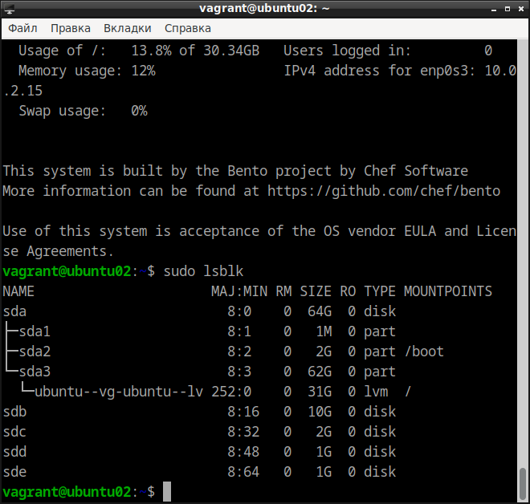

Продолжаем существующую по умолчанию LVG на /dev/sdb и копируем туда рута:

```
# определяем переменную BASEDISK=/dev/sdb
BASEDISK=$(sudo lsblk | grep 10G | grep disk | awk '{print "/dev/"$1}')
# создаём LVG на устройстве /dev/sdb
sudo pvcreate $BASEDISK
# находим имя LVG с рутом
LVG=$( sudo vgs | awk '{print $1}' | tail -1 )
sudo vgextend $LVG $BASEDISK
# создаём volume для рута на добавленном физ. томе
sudo lvcreate -L9G -n myroot $LVG $BASEDISK
# создаём ФС ext4 на разделе
sudo mkfs.ext4 /dev/$LVG/myroot
# монтируем полученный раздел и копируем туда рута
sudo mount /dev/$LVG/myroot /mnt/
```
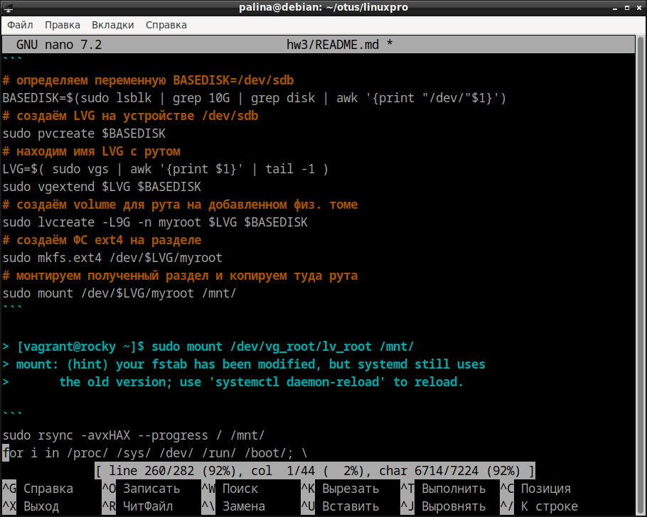

Игнорируем предложение ```systemctl daemon-reload``` ! \
Иначе ничего не получится

```
sudo rsync -avxHAX --progress / /mnt/
sudo -i
for i in /proc/ /sys/ /dev/ /run/ /boot/; \
 do mount --bind $i /mnt/$i; done
ls /mnt/
ls /mnt/boot/
```

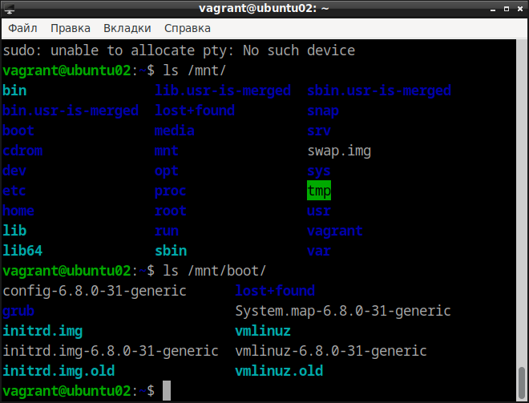

```
chroot /mnt/
grub-mkconfig -o /boot/grub/grub.cfg
```

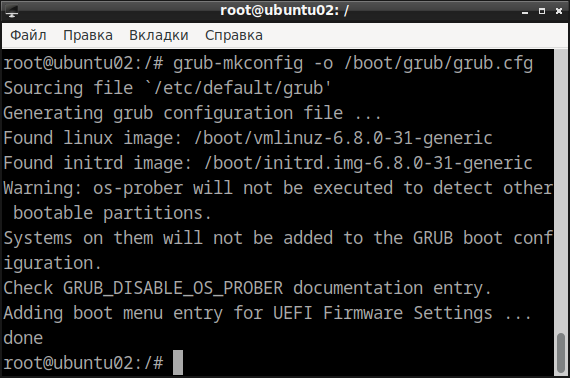

```
update-initramfs -u
exit
reboot
```

Ждём, пока перезагрузится, и заходим

```
vagrant ssh
```
## 2b. Изменение корневого раздела - продолжение

После перезагрузки:

```
sudo lsblk
```

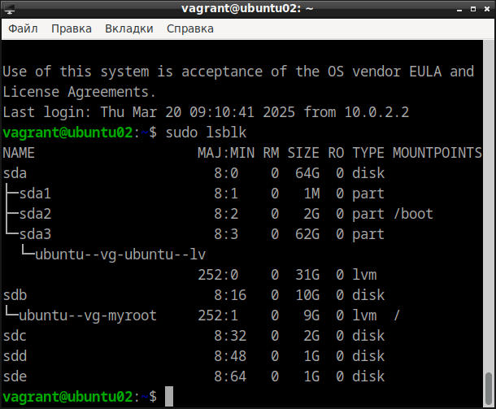

Изменяем старый LV.
Затем возвращаем на него root по предыдущему алгоритму:

```
sudo lvremove -y /dev/ubuntu-vg/ubuntu-lv
sudo lvcreate -n ubuntu-lv -L8G /dev/ubuntu-vg -y
sudo mkfs.ext4 /dev/ubuntu-vg/ubuntu-lv
sudo mount /dev/ubuntu-vg/ubuntu-lv /mnt/
sudo rsync -avxHAX --progress / /mnt/
sudo -i
for i in /proc/ /sys/ /dev/ /run/ /boot/; \
    do sudo  mount --bind $i /mnt/$i; done
ls /mnt/
ls /mnt/boot/
```

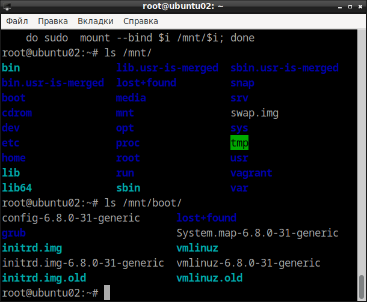

```
chroot /mnt/
grub-mkconfig -o /boot/grub/grub.cfg
update-initramfs -u
```

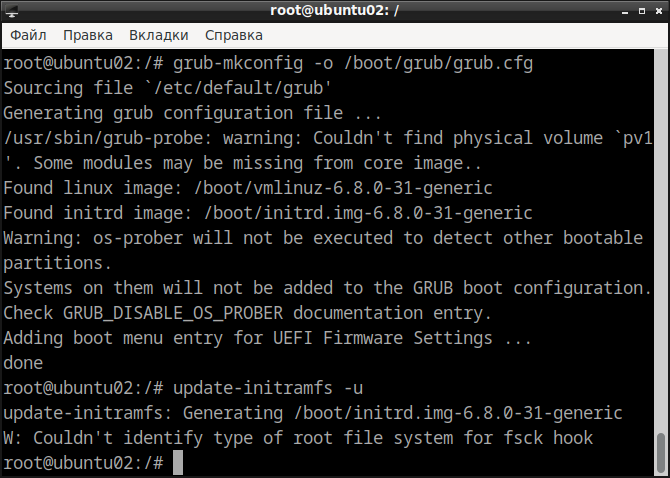

Выходим и перезагружаемся

```
exit
reboot
```

Ждём, пока перезагрузится, и заходим

```
vagrant ssh
```
### 2c. Изменение корневого раздела - окончание

```
sudo lsblk
```

Видим, что корневой раздел теперь занимает 8G.

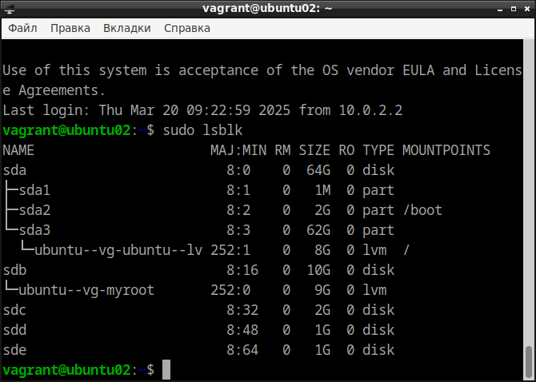

Удаляем LV myroot и PV /dev/sdb из LVG

```
LVG=$( sudo vgs | awk '{print $1}' | tail -1 )
BASEDISK=$(sudo lsblk | grep 10G | grep disk | awk '{print "/dev/"$1}')
sudo lvremove -y /dev/$LVG/myroot
sudo vgreduce $LVG $BASEDISK
sudo pvremove $BASEDISK
```

## 3a. Создание раздела под var на raid1

Создаём raid1 на /dev/sdd и /dev/sde

```
MIRRORDISKS=$(sudo lsblk | grep 1G | grep disk | awk '{print "/dev/"$1}')
echo $MIRRORDISKS | xargs sudo mdadm --zero-superblock --force
RAID1='/dev/md1'
echo $MIRRORDISKS | xargs sudo mdadm --create --verbose --metadata=0.90 $RAID1 -l 1 -n 2
```

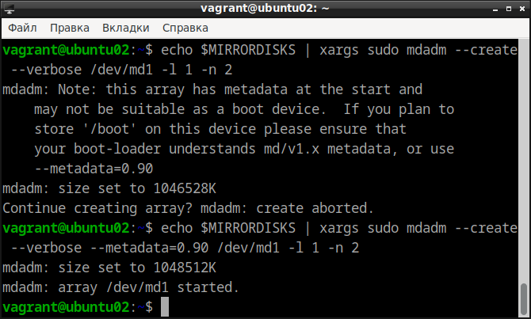

Добавляем созданный массив в LVG, \
создаём на нём logical volume и монтируем в /mnt/, \
чтобы перенести туда содержимое /var

```
sudo pvcreate $RAID1
sudo vgextend $LVG $RAID1
sudo lvcreate -L+100%FREE -n myvar $LVG $RAID1
sudo mkfs.ext4 /dev/$LVG/myvar
sudo mount /dev/$LVG/myvar  /mnt/
sudo cp -aR /var/* /mnt/
sudo mkdir /tmp/oldvar && sudo mv /var/* /tmp/oldvar
sudo umount /mnt/
sudo mount /dev/$LVG/myvar /var
sudo lsblk
```

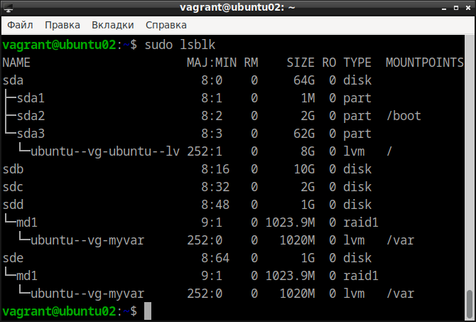

Записываем изменения в /etc/fstab

```
touch ~/file.tmp
sudo cat /etc/fstab >> ~/file.tmp
echo "$(sudo blkid | grep var: | awk '{print $2}') \
      /var ext4 defaults 0 0" >> ~/file.tmp
sudo cp ~/file.tmp /etc/fstab
```

Записываем изменения в /etc/mdadm/mdadm.conf

```
rm ~/file.tmp
touch ~/file.tmp
echo "DEVICE partitions" > file.tmp
sudo mdadm --detail --scan --verbose | sudo awk '/ARRAY/{print}' >> file.tmp
sudo cp file.tmp /etc/mdadm/mdadm.conf
```

## 3b. Создание раздела под home

создаём том под home

```
sudo lvcreate -n myhome -L2G /dev/$LVG
sudo mkfs.ext4 /dev/$LVG/myhome
sudo mount /dev/$LVG/myhome /mnt/
sudo cp -aR /home/* /mnt/
sudo rm -rf /home/*
sudo umount /mnt
sudo mount /dev/$LVG/myhome /home/
sudo chown -R vagrant:vagrant /home/vagrant
```
записываем изменения в /etc/fstab

```
cd ..
cd /home/vagrant
touch file.tmp
sudo cat /etc/fstab >> file.tmp
echo "$( sudo blkid | grep -i home | awk '{print $2}' ) \
      /home ext4 defaults 0 0" >> file.tmp
sudo cp file.tmp /etc/fstab
sudo rm file.tmp
df -Th
```

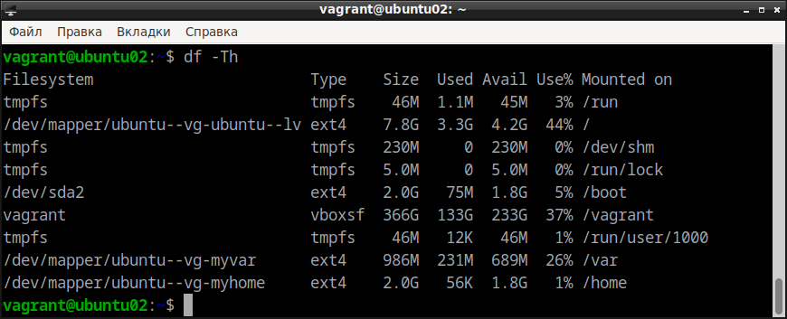

перезагружаемся, чтобы убедиться, что все изменения сохранятся

```
sudo reboot
vagrant ssh
sudo lsblk
sudo df -h
```

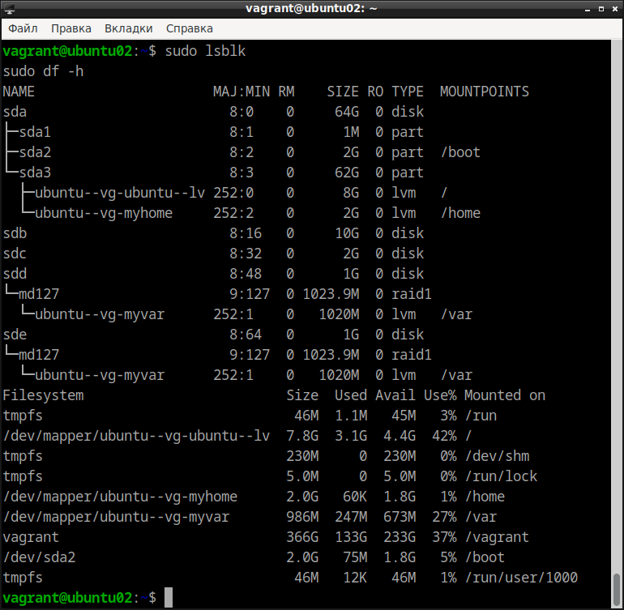

точки монтирования и raid1 сохранились

## 4. Работа со снапшотами

создаём доп. файлы в home

```
touch /home/vagrant/file{1..20}
ls /home/vagrant/ 
```

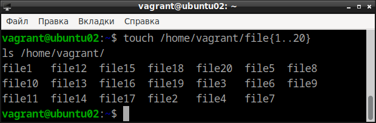

создаём снапшот

```
LVG=$( sudo vgs | awk '{print $1}' | tail -1 )
sudo lvcreate -L 100M -s -n home-snap /dev/$LVG/myhome
```

удаляем файлы и восстанавливаемся со снапшота

```
rm -f /home/vagrant/file{1..20}
ls /home/vagrant/
```

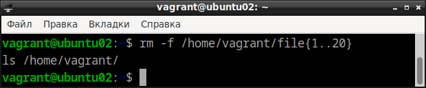

```
cd /
sudo umount /home
sudo lvconvert --merge /dev/$LVG/home-snap
sudo mount /dev/$LVG/myhome /home
ls /home/vagrant/
```

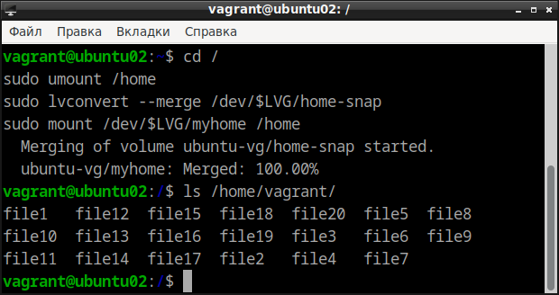

Файлы восстановлены
