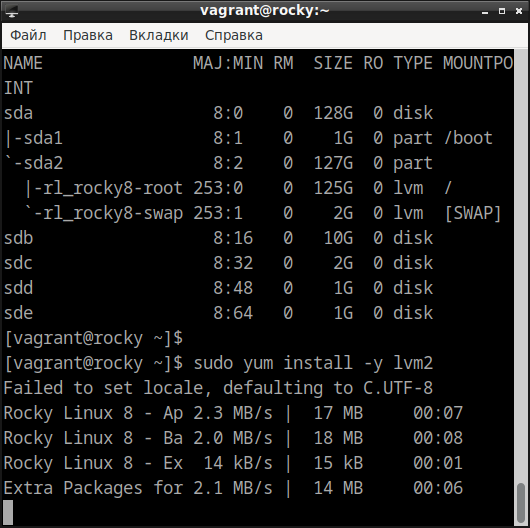
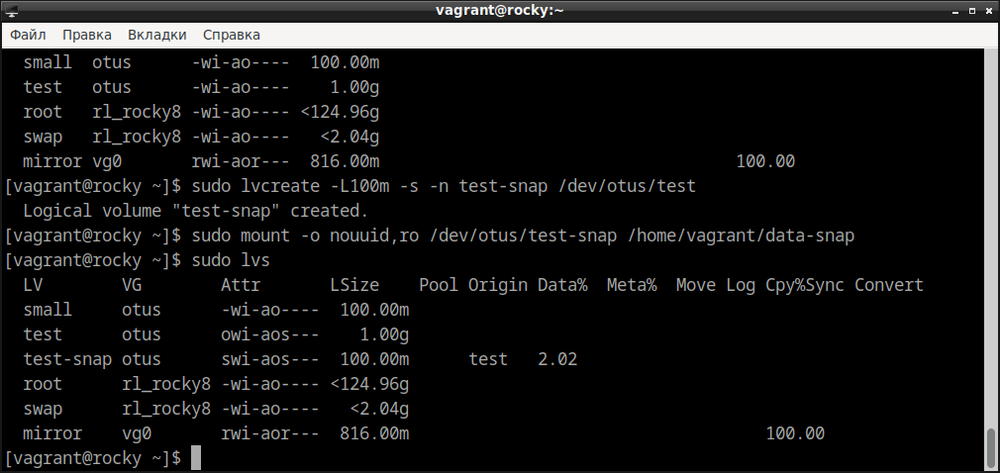

# Домашнее задание по курсу "Administrator Linux. Professional"

**Название задания:** 

  - Работа с файловыми системами. 

**Текст задания:** 

  1. Тестовое задание:
  - Создать LVG. 
  - Расширить и уменьшить Logical Volume.
  - Создать снапшот, изменить данные и откатиться на созданный снапшот.
  - Создать RAID mirror средствами LVM.
  2. Изменение корневого раздела:
  - Уменьшить том под / до 8G.
  - Выделить том под /home.
  - Выделить том под /var - сделать в mirror.
  - /home - сделать том для снапшотов.
  - Прописать монтирование в fstab.
  - Попробовать с разными опциями и разными файловыми системами (на выбор).
  3. Работа со снапшотами:
  - сгенерить файлы в /home/;
  - снять снапшот;
  - удалить часть файлов;
  - восстановится со снапшота.
  * На дисках попробовать поставить btrfs/zfs \
    — с кэшем, снапшотами и разметить там каталог /opt.

## 1. Тестовое задание.
   
 - Исходная ситуация с дисками: 
 
```
sudo lsblk
```



```
# устанавливаем необходимый пакет
sudo yum install -y lvm2
sudo lvmdiskscan
``` 


- Создаем LVG с двумя разделами

```
# определяем переменную BASEDISK = /dev/sdb
BASEDISK=$(sudo lsblk | grep 10G | grep disk | awk '{print "/dev/"$1}')
# создаём LVG otus на устройстве /dev/sdb
sudo pvcreate $BASEDISK
sudo vgcreate otus $BASEDISK
# создаем 2 лог. раздела: /dev/otus/test и /dev/otus/small
sudo lvcreate -l+80%FREE -n test otus
sudo lvcreate -L100M -n small otus
# создаём ФС xfs на /dev/otus/test и монтируем в ~/data/
sudo mkfs.xfs /dev/otus/test
mkdir /home/vagrant/data
sudo mount /dev/otus/test /home/vagrant/data/
sudo chown -R vagrant:vagrant /home/vagrant/data
# создаём ФС xfs на /dev/otus/small и монтируем в ~/data/
sudo mkfs.xfs /dev/otus/small
mkdir /home/vagrant/and
sudo mount /dev/otus/small /home/vagrant/and/
sudo chown -R vagrant:vagrant /home/vagrant/and
```

Проверяем, что всё верно: смотрим информацию о ```volume groups```, \
```physical volumes``` и ```logical volumes```:

```
sudo vgdisplay  | grep -i ' name'
sudo vgdisplay -v | grep -i 'pv name'
sudo vgdisplay -v | grep -i 'lv name'
```


- Расширим LV ```/dev/otus/test``` за счет добавления диска в LVM

```
#  определяем переменную SNAPDISK = /dev/sdc
SNAPDISK=$(sudo lsblk | grep 2G | grep disk | awk '{print "/dev/"$1}' )
# расширяем LVG за счёт /dev/sdc
sudo pvcreate $SNAPDISK
sudo vgextend otus $SNAPDISK
# занимаем всё место на /dev/otus/small и /dev/otus/and
dd if=/dev/random of=/home/vagrant/data/test.log \
    bs=1M count=8000 status=progress
dd if=/dev/random of=/home/vagrant/and/test.log \
    bs=1M count=8000 status=progress
```

К сожалению, команда ```dd``` не заполнила полностью ни один из разделов:


```
# расширяем том /dev/otus/test
sudo lvextend -l+80%FREE /dev/otus/test
sudo xfs_growfs /dev/otus/test
```

Теперь нужно уменьшить раздел ```/dev/otus/test```. \
Но xfs не умеет уменьшаться, поэтому сначала создадим mirror \
на /dev/sdb/ и /dev/sde, скопируем данные, \
а потом попробуем пересоздать xfs

- Делаем mirror на /dev/sdb/ и /dev/sde

```
# /dev/sdd /dev/sde
MIRRORDISKS=$(sudo lsblk | grep 1G | grep disk | awk '{print "/dev/"$1}')
# создаём RAID
sudo pvcreate $MIRRORDISKS
sudo vgcreate vg0 $MIRRORDISKS
sudo lvcreate -l+80%FREE -m1 -n mirror vg0
sudo lvs
```


```
# монтируем:
mkdir /home/vagrant/mirror
sudo mkfs.xfs /dev/vg0/mirror
sudo mount /dev/vg0/mirror /home/vagrant/mirror/
sudo chown -R vagrant:vagrant /home/vagrant/mirror/
# копируем:
cp -aR /home/vagrant/data/* /home/vagrant/mirror/
```
- Уменьшаем LV /dev/otus/test:

```
# уменьшаем логический том /dev/otus/test
sudo umount /dev/otus/test
sudo lvreduce -y /dev/otus/test -L 1G
# пересоздаём файловую систему
sudo mkfs.xfs -f /dev/otus/test 
sudo mount /dev/otus/test /home/vagrant/data/
sudo chown -R vagrant:vagrant /home/vagrant/data
```
копируем обратно с массива

```
cp -aR /home/vagrant/mirror/* /home/vagrant/data/
sudo rm -rf /home/vagrant/mirror/*
```

Файл на месте


- Создание снапшота

```
#создаём снапшот
sudo lvcreate -L100m -s -n test-snap /dev/otus/test
sudo mount -o nouuid,ro /dev/otus/test-snap /home/vagrant/data-snap
sudo lvs
```



Создаём файлы в /dev/otus/data

```
touch /home/vagrant/data/file{1,2,3,4,5}
dd if=/dev/random of=/home/vagrant/data/file1 bs=1M count=70
sudo lvs
```


Поле "Data" в строке снэпшота изменилось.

```
# восстанавливаемся со снапшота
sudo umount /home/vagrant/data-snap
sudo umount /home/vagrant/data
sudo lvconvert --merge /dev/otus/test-snap
sudo mount /dev/otus/test /home/vagrant/data
sudo chown -R vagrant:vagrant /home/vagrant/data-snap
```
Восстановление прошло успешно.


Записываем точки монтирования в fstab, но перед этим делаем копию \
etc/fstab для восстановления чистой системы перед следующим упражнением.

```
sudo cp /etc/fstab /etc/fstab.bkp
touch /home/vagrant/data/file.tmp
sudo cat /etc/fstab > /home/vagrant/data/file.tmp
for i in otus-test vg0-mirror otus-small ;
do
      echo "$( sudo blkid | grep "\/dev\/mapper\/$i:"  | awk '{print $2}' ) \
      $( df -h | grep "\/dev\/mapper\/$i" | awk '{print $6}' ) \
      xfs defaults 0 0" >> /home/vagrant/data/file.tmp;
done
sudo cp /home/vagrant/data/file.tmp /etc/fstab
exit
```
При перезагрузке VM зависает, поэтому выходим и перезагружаем принудителььно: \

```
vagrant halt
vagrant up
vagrant ssh
```

***после перезагрузки***

убеждаемся, что точки монтирования сохранились:

```
sudo df -h
```


## 2. Изменение корневого раздела - подготовка.

Сначала восстанавливаем чистую систему: удаляем LVG, \
восстанавливаем исходный /etc/fstab

```
sudo mv /etc/fstab.bkp /etc/fstab
# удаляем lvs
sudo umount /home/vagrant/*
sudo vgremove -f vg0
sudo vgremove -f otus
```

Создаём LVG на /dev/sdb и копируем туда рута:

```
# определяем переменную BASEDISK=/dev/sdb
BASEDISK=$(sudo lsblk | grep 10G | grep disk | awk '{print "/dev/"$1}')
# создаём LVG на устройстве /dev/sdb
sudo pvcreate $BASEDISK
sudo vgcreate vg_root $BASEDISK
# создаём volume для рута на весь раздел
sudo lvcreate -n lv_root -l+100%FREE -y vg_root
# создаём ФС xfs на разделе
sudo mkfs.xfs /dev/vg_root/lv_root
# монтируем полученный раздел и копируем туда рута
sudo mount /dev/vg_root/lv_root /mnt/
```

> [vagrant@rocky ~]$ sudo mount /dev/vg_root/lv_root /mnt/
> mount: (hint) your fstab has been modified, but systemd still uses
>       the old version; use 'systemctl daemon-reload' to reload.

```
sudo rsync -avxHAX --progress / /mnt/
```
```
