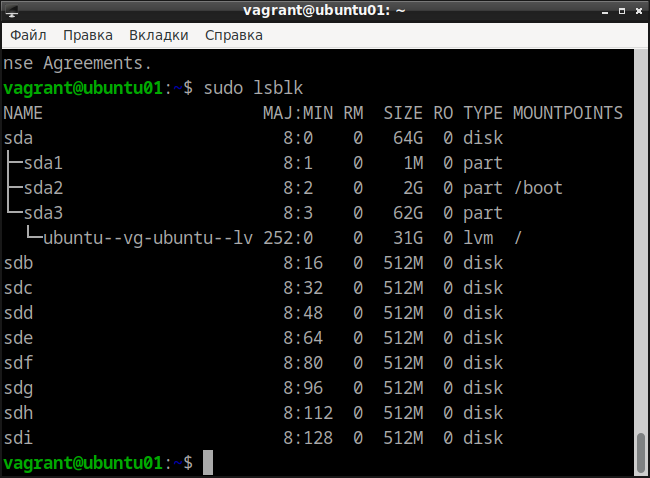
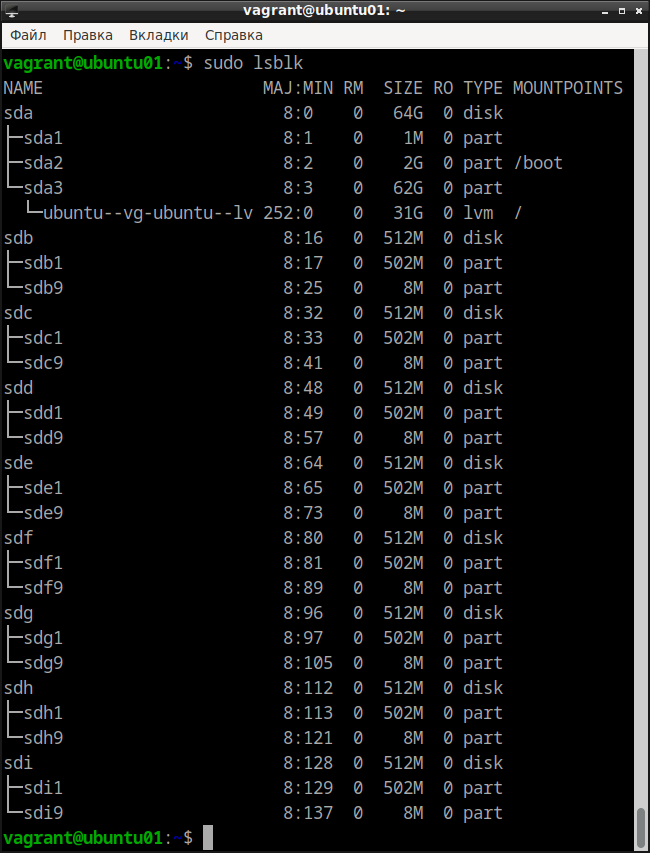
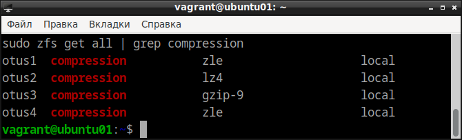
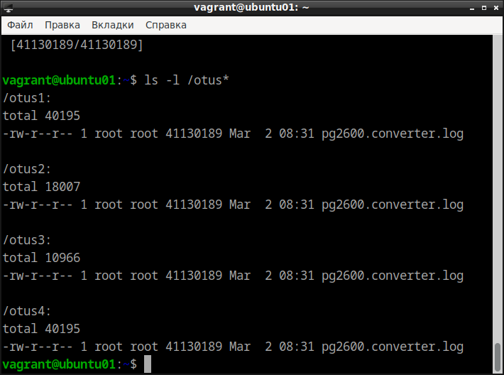
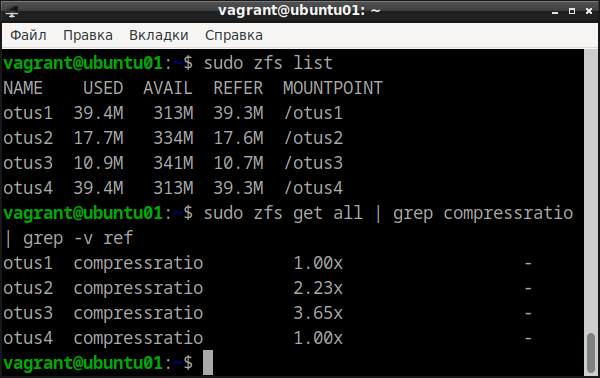
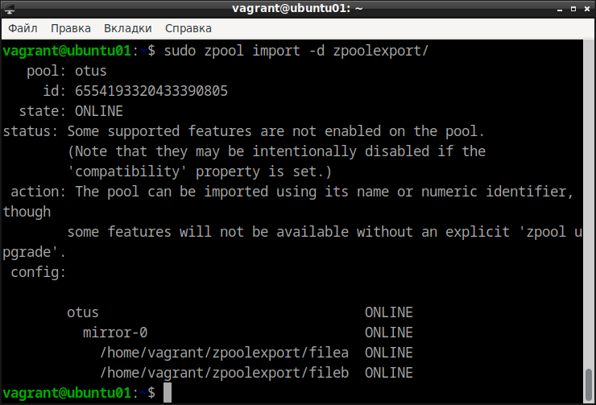
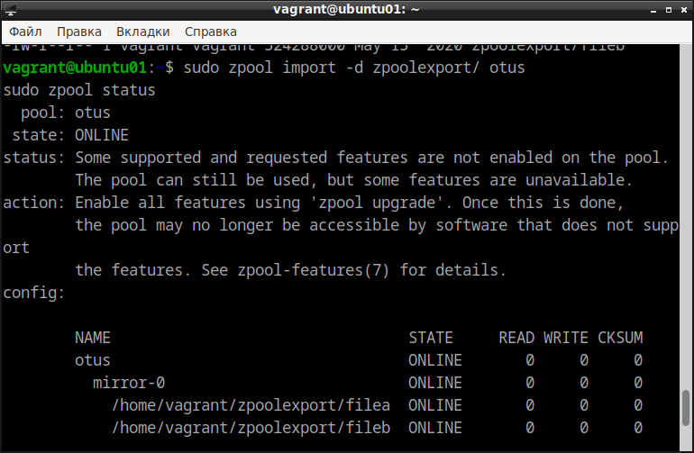
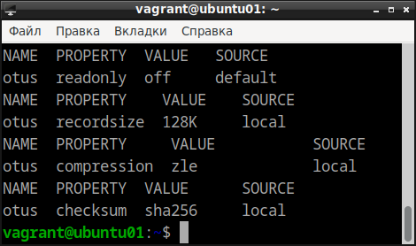
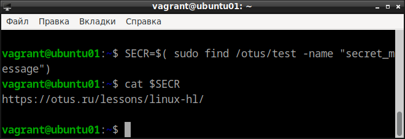

# Домашнее задание по курсу "Administrator Linux. Professional"

**Название задания:** 

  - Работа с файловой системой ZFS. 

**Текст задания:** 

  1. Определить алгоритм с наилучшим сжатием:
  - определить какие алгоритмы сжатия поддерживает zfs (gzip, zle, lzjb, lz4);
  - создать 4 файловых системы на каждой применить свой алгоритм сжатия;
  - для сжатия использовать либо текстовый файл, либо группу файлов.
  2. Определить настройки пула:
  - с помощью команды zfs import собрать pool ZFS.
  - командами zfs определить настройки:
  - *размер хранилища;
  - *тип pool;
  - *значение recordsize;
  - *какое сжатие используется;
  - *какая контрольная сумма используется.
  3. Работа со снапшотами:
  - скопировать файл из удаленной директории;
  - снять снапшот;
  - восстановить файл локально. zfs receive;
  - найти зашифрованное сообщение в файле secret_message.

## 1. Определить алгоритм с наилучшим сжатием.
   
 - Исходная ситуация с дисками: 
 
```
sudo lsblk
```


Устанавливаем необходимый пакет

```
sudo apt install -y zfsutils-linux
``` 

Определяем переменные

```
MIR1=$( sudo lsblk | grep disk | grep 512M | awk '{print $1}' | head -2 )
MIR2=$( sudo lsblk | grep disk | grep 512M | awk '{print $1}' | head -4 | tail -2 )
MIR3=$( sudo lsblk | grep disk | grep 512M | awk '{print $1}' | head -6 | tail -2 )
MIR4=$( sudo lsblk | grep disk | grep 512M | awk '{print $1}' | head -8 | tail -2 )
```

Создаём 4 пула

```
sudo zpool create otus1 mirror $MIR1
sudo zpool create otus2 mirror $MIR2
sudo zpool create otus3 mirror $MIR3
sudo zpool create otus4 mirror $MIR4
sudo lsblk
```



добавляем алгоритмы сжатия в каждый массив

```
sudo zfs set compression=lzjb otus1
sudo zfs set compression=lz4 otus2
sudo zfs set compression=gzip-9 otus3
sudo zfs set compression=zle otus4
sudo zfs get all | grep compression
```



Скачиваем файл

```
for i in {1..4}; do sudo wget -P /otus$i \
    https://gutenberg.org/cache/epub/2600/pg2600.converter.log; done
sudo ls -l /otus*
```



Просматриваем занятое место

```
sudo zfs list
sudo zfs get all | grep compressratio | grep -v ref
```



Делаем вывод, что gzip-9 - самый эффективный алгоритм сжатия

## 2. Определение настроек пула.

Скачиваем архив в домашний каталог, разархивируем и пытаемся \
импортировать полученный каталог в пул. Не получается:

```
cd
wget -O archive.tar.gz --no-check-certificate 'https://drive.usercontent.google.com/download?id=1MvrcEp-WgAQe57aDEzxSRalPAwbNN1Bb&export=download'
tar -xzvf archive.tar.gz
sudo zpool import -d zpoolexport/
```



```
sudo zpool import -d zpoolexport/ otus
sudo zpool status
```



Таким обазом, мы импортировали пул с именем ```otus```. \
Определяем его настройки:

```
# определение всех настроекЖ
sudo zfs get all otus
# определение конкретных настроек:
sudo zfs get readonly otus
sudo zfs get recordsize otus
sudo zfs get compression otus
sudo zfs get checksum otus
```



## 3. Работа со снапшотами 

Скачиваем архив в домашний каталог, разархивируем и  \
восстанавливаем файловую систему из снапшота. \
Затем ищем в каталоге ~/otus/test файл с именем ```secret message``` \
и выводим на экран содержимое этого файла:

```
cd
wget -O otus_task2.file --no-check-certificate https://drive.usercontent.google.com/download?id=1wgxjih8YZ-cqLqaZVa0lA3h3Y029c3oI&export=download
sudo zfs receive otus/test@today < otus_task2.file
SECR=$( sudo find /otus/test -name "secret_message")
cat $SECR 
```


