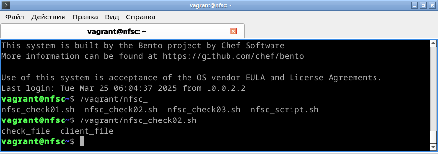
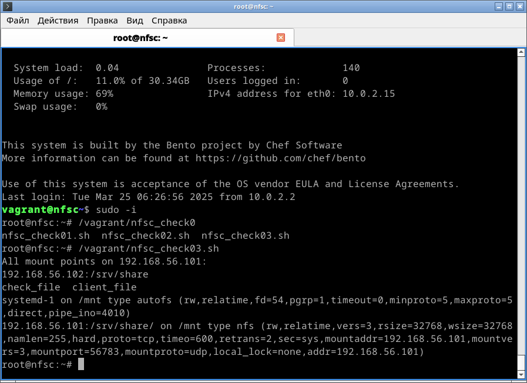

# Домашнее задание по курсу "Administrator Linux. Professional"

**Название задания:** 

  - Работа с файловой системой NFS. 

**Текст задания:** 

  1. Развернуть сервис NFS и подключить к нему клиента:
  - запустить 2 VM: сервер NFS и клиента;
  - подготовить на сервере и экспортировать директорию ```/srv/share```, 
    в директории создать папку ```/upload``` с правами записи и чтения на неё; \
    монтирование должно быть организовано с использованием ```NFSv3```
  - установить на клиенте автоматическое монтирование экспортированной 
    директории в ```/mnt/```;

  2. Проверить работу полученной системы: 

     a. Проверка рабтоспособности
        - на сервере создаём файл ```check_file```  
          в экспортированной директории ```/srv/share/upload/```.
        - на клиенте проверяем наличие созданного файла 
          в подмонтированной директории ```/mnt/upload/```, \
          и создаём там файл client_file.
        - на сервере проверяем наличие обоих файлов
          в экспортированной директории ```/srv/share/upload/```
        
     b. Проверка сохранениия подключения после перезагрузки

        - на клиенте:

           - перезагружаем клиент 
           - заходим на клиент и проверяем наличие созданных файлов  
             в подмонтированной директории ```/mnt/upload/```

        - на сервере:

           - перезагружаем сервер,
           - заходим на сервер и проверяем наличие созданных файлов 
              в экспортированной директории ```/mnt/upload/```
           - проверяем экспорты: ```exportfs -s```
           - проверяем работу RPC: ```showmount -a [ip адрес сервера]```

        - на клиенте

           - перезагружаем клиент,
           - заходим на клиент и проверяем работу RPC: 
            ```showmount -a [ip адрес сервера]```
           - проверяем статус монтирования: ```mount | grep mnt```
           - проверяем наличие ранее созданных файлов    
            в подмонтированной директории ```/mnt/upload/``` \
            и создаём там файл client_file.
        
        - на сервере 

           - на сервере проверяем наличие всех трёх созданных файлов 
            в экспортированной директории ```/srv/share/upload/```

**Реализация:**

  - написан Vagrantfile для создания двух VM:  

    сервер ```nfss```, ip 192.168.56.101 \
    клиент ```nfsc```, ip 192.168.56.102
  - для установки NFS написаны скрипты 

    ```nfss_script.sh``` и ```nfsc_script.sh```
  - для проверки работоспособности системы до и после 

    перезагрузки написаны скрипты \
    ```nfss_check01.sh```, ..., ```nfss_check04.sh``` \ 
    и ```nfsс_check01.sh``` ```nfss_check03.sh```. 

## 1. Создание виртуалок и установка соединения NFS.
   
 - Скачиваем данную директорию, заходим в неё поднимаем VM через vagrant: 
 
```
vagrant up nfss
vagrant up nfsc
```

 - Заходим на сервер и запускаем скрипт от имени root:

```
vagrant ssh nfss
sudo -i
/vagrant/nfss_script.sh
```

 - Заходим на клиент и запускаем скрипт от имени root:

```
vagrant ssh nfsс
sudo -i
/vagrant/nfsс_script.sh
```

### 2a. Проверка работоспособности

*на сервере*

 - запускаем первый проверочный скрипт, 
   он создаёт файл в экспортированной директории \
   и выводит информацию об экспортах командой ```exportfs -s```:

```
/vagrant/nfss_check01.sh
``` 


*на клиенте* 

 - запускаем первый проверочный скрипт, 
   он проверяет наличие созданных файлов и создаёт свой:

```
/vagrant/nfsc_check01.sh
``` 


*на сервере*

 - запускаем второй проверочный скрипт, \
   он проверяет наличие всех файлов:

```
/vagrant/nfss_check02.sh
``` 


### 2b. Проверка работы после перезагрузки

*на клиенте*

  - перезагружаем клиент

```
reboot
```

  - ждём! иначе vagrant может сломаться.
  - заходим на клиент, запускаем второй проверочный скрипт \
    для проверки наличия файлов в подмонтированной директории:

```
vagrant ssh nfsc
/vagrant/nfsc_check02.sh
``` 



*на сервере*

  - перезагружаем сервер,

```
reboot
```

  - ждём!
  - заходим на сервер, от имени root запускаем третий проверочный скрипт \
    для проверки экспортов, работы RPC и \
    наличия файлов в подмонтированной директории:

```
vagrant ssh nfss
sudo -i
/vagrant/nfss_check03.sh
``` 


*на клиенте*

  - перезагружаем клиент,

```
reboot
```

  - ждём!
  - заходим на клиент, от имени root запускаем третий проверочный скрипт \
    для проверки работы RPC, статуса монтирования и \
    наличия файлов в подмонтированной директории, \
    а также для создания в ней ещё одного файла:

```
vagrant ssh nfsс
sudo -i
/vagrant/nfsс_check03.sh
``` 



*на сервере*

   - на сервере запускаем четвёртый проверочный скрипт \
     для проверки наличия всех созданных файлов \
     в экспортированной директории:

```
/vagrant/nfss_check04.sh
``` 


