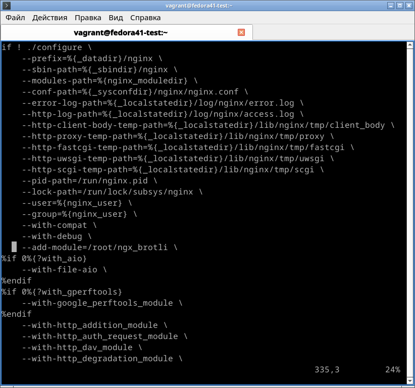
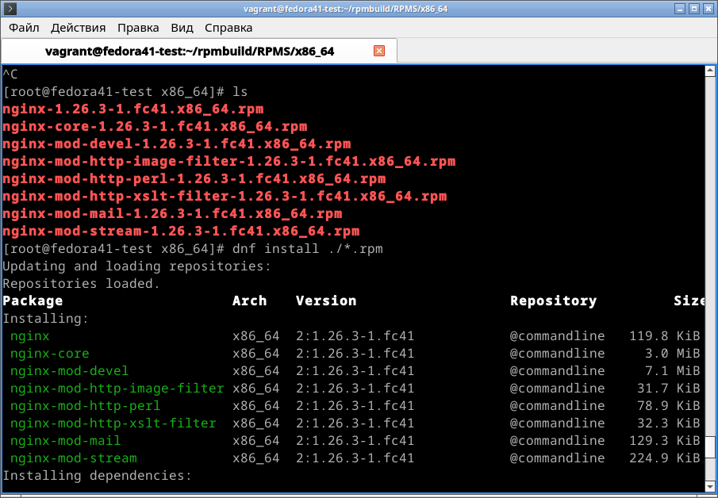
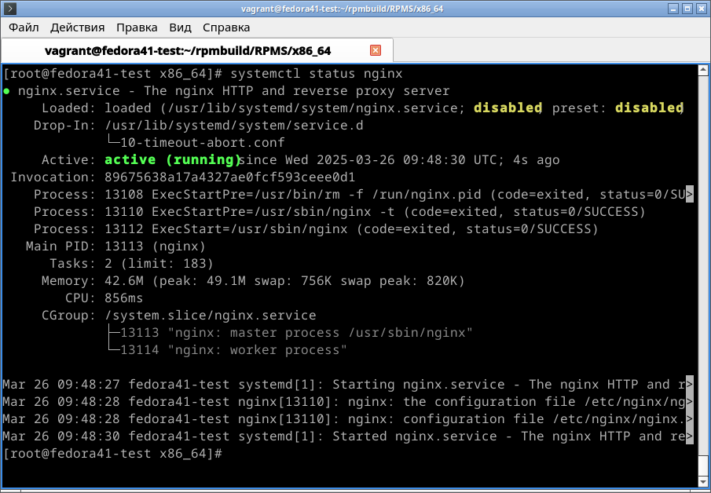
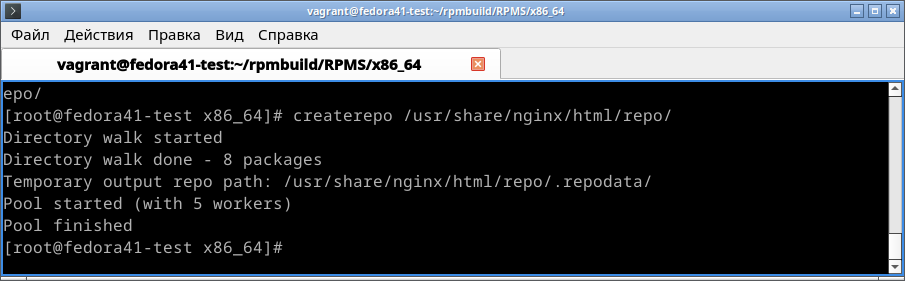
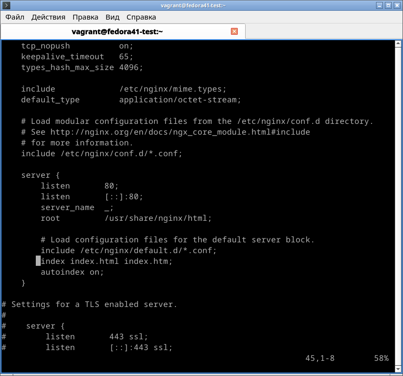
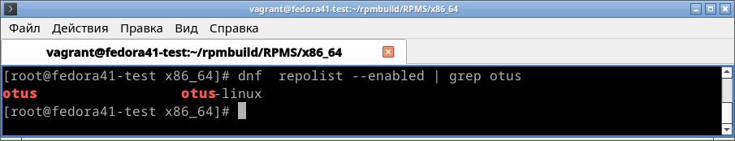
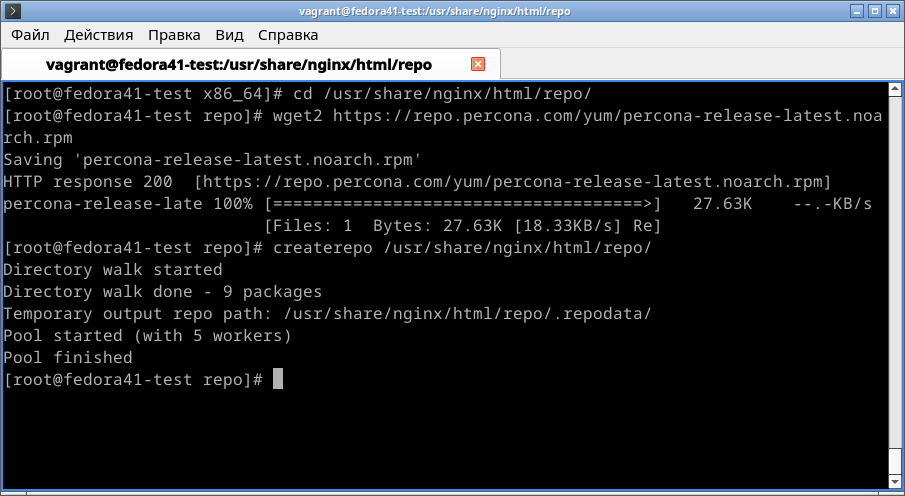
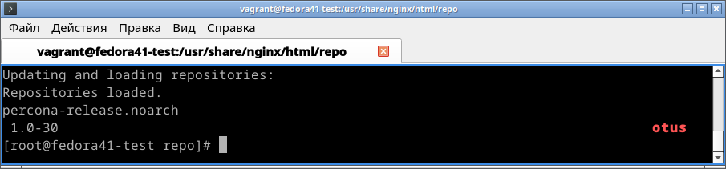
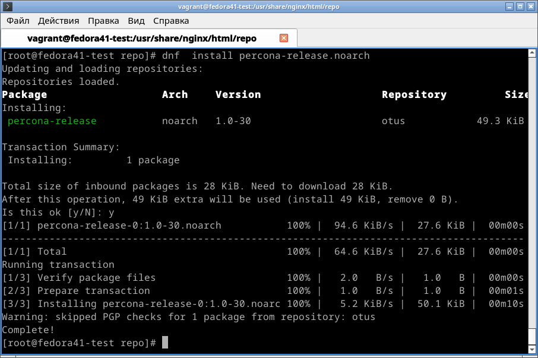

# Домашнее задание по курсу "Administrator Linux. Professional"

**Название задания:** 

  - Работа с репозиторием RPM.

**Текст задания:** 

  1. Собрать свой RPM пакет (nginx с дополнительным модулем ngx_brotli).

  2. Создать свой репозиторий и разместить там собранный пакет. 

**Реализация:**

  - написан Vagrantfile для создания  VM (ОС fedora-41) 
  - приведён листинг команд и скриншоты с выводом нескольких команд

## 1. Сборка пакета

 - Создаём VM и заходим в root

```
vagrant up
vagrant ssh
sudo passwd root
```

 - Вводим пароль 1, система ругается, но вводим 1 повторно и входим под рута,
   используя созданный пароль.

```
su root
/vagrant/nfsс_script.sh
```

 - устанавливаем пакеты, необходимые для сборки. Лучше устанавливать по одному  
   пакету, потому что система может написать ```Killed!``` вместо установки, \
   если попытаться установить все сразу По той же причине сначала выполняем \
   ```dnf install [пакет]```, а потом подтверждаем ```y```:

```
dnf install wget2
dnf install rpmdevtools
dnf install rpm-build
dnf install createrepo
dnf install dnf-utils
dnf install cmake gcc git nano
``` 

 - заходим в ```~root``` и создаём директорию, затем скачиваем в неё всё, 
   что нужно для сборки nginx. Важно сначала перейти в ```~root```, без этого сборка не удавалась.

```
cd 
mkdir rpm && cd rpm
dnf download --source nginx
rpm -Uvh nginx*.src.rpm
dnf builddep nginx
``` 

 - последняя команда нужна, чтобы установить все необходимые зависимости для 
   сборки пакета. Она очень важна, если закончится ```Killed!```, нужно запустить ещё раз.

 - скачиваем исходный код модуля ```ngx_brotli``` и собираем его:

```
cd /root
git clone --recurse-submodules -j8 https://github.com/google/ngx_brotli
cd ngx_brotli/deps/brotli
mkdir out && cd out
cmake -DCMAKE_BUILD_TYPE=Release -DBUILD_SHARED_LIBS=OFF -DCMAKE_C_FLAGS="-Ofast -m64 -march=native -mtune=native -flto -funroll-loops -ffunction-sections -fdata-sections -Wl,--gc-sections" -DCMAKE_CXX_FLAGS="-Ofast -m64 -march=native -mtune=native -flto -funroll-loops -ffunction-sections -fdata-sections -Wl,--gc-sections" -DCMAKE_INSTALL_PREFIX=./installed ..
cmake --build . --config Release -j 2 --target brotlienc
cd ../../../..
```

  - подправляем ```.spec``` файл для сборки nginx, чтобы пакет собирался с модулем ngx_brotli

```
vi /root/rpmbuild/SPECS/nginx.spec
```

  - добавляем ```--add-module=/root/ngx_brotli \``` в конец инструкции ```configure```



  - собираем пакет nginx

```
cd /root/rpmbuild/SPECS/
rpmbuild -ba nginx.spec -D 'debug_package %{nil}'
```
  - убеждаемся, что пакеты созданы:



```
ll rpmbuild/RPMS/x86_64/
``` 

  - устанавливаем собранный пакет и убеждаемся, что работтает:

```
cd rpmbuild/RPMS/x86_64/
dnf install *.rpm
systemctl start nginx
systemctl status nginx
```



## 2. Создание репозитория с созданным пакетом

 - Создаём стандартную для nginx директорию и копируем туда созданные пакеты:

```
mkdir /usr/share/nginx/html/repo
cp /root/rpmbuild/RPMS/x86_64/*.rpm /usr/share/nginx/html/repo/
```

 - Инициализируем репозиторий:

```
createrepo /usr/share/nginx/html/repo/
```



 - В полученном репозитории 8 пакетов. 
   Настраиваем в nginx доступ к листингу каталога: добавляем в \
   ```/etc/nginx/nginx.conf ``` к блоку ```server``` строки

> index index.html index.htm;

> autoindex on;



```
nginx -t
nginx -s reload
```

  - добавляем репозиторий в ```/etc/yum.repos.d```:

```
cat >> /etc/yum.repos.d/otus.repo << EOF
[otus]
name=otus-linux
baseurl=http://localhost/repo
gpgcheck=0
enabled=1
EOF
```

 - убеждаемся, что репозиторий подключился:


```
dnf repolist --enabled | grep otus
```



## 3. Добавление пакета в репозиторий

```
cd /usr/share/nginx/html/repo/
wget2 https://repo.percona.com/yum/percona-release-latest.noarch.rpm
```

 - обновляем список пакетов в репозитории:

```
dnf makecache
```



 - стало уже 9 пакетов. Проверяем, что пакет подключился:

```
dnf list | grep otus
```



  - устанавлиаем пакет:

```
dnf  install percona-release.noarch

```



  - пакет установлен.
