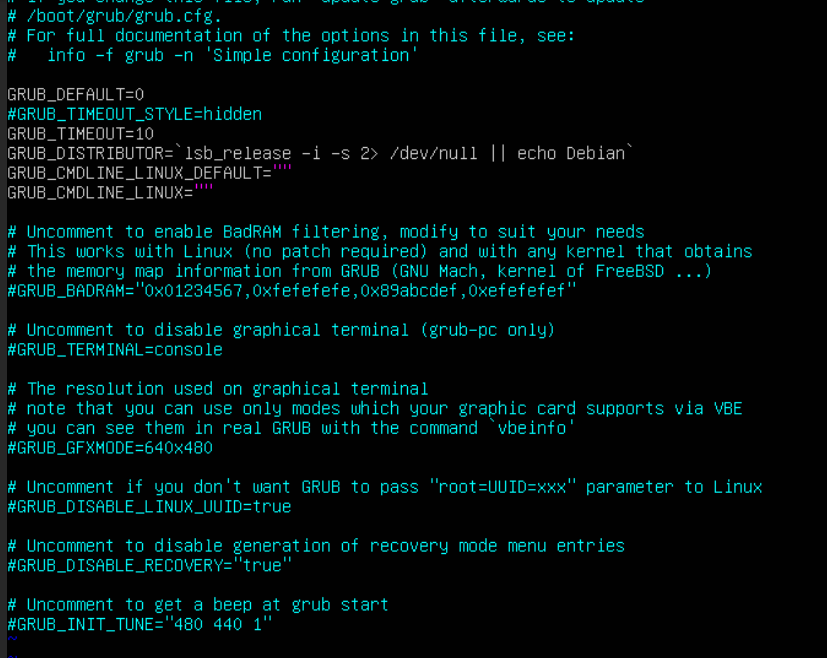
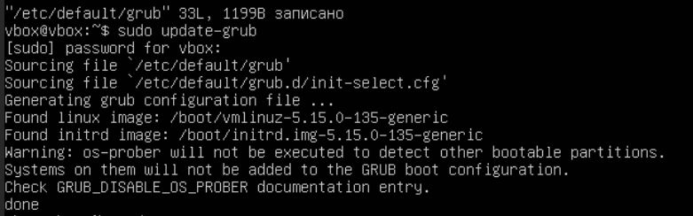
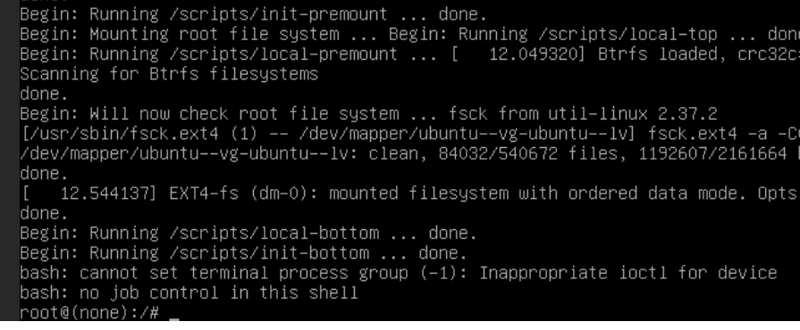
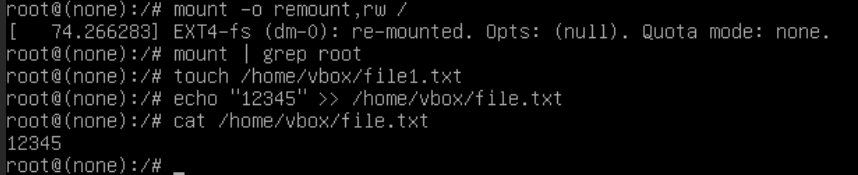
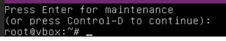
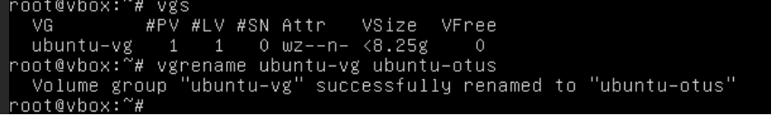

# Домашнее задание по курсу "Administrator Linux. Professional"

**Название задания:** 

  - Загрузка системы

**Текст задания:** 

  1. Включить отображение меню ```Grub```.

  2. Попасть в систему без пароля двумя способами:
     - через ```init=/bin/bash```
     - через ```recovery mode```

  3. Переименовать VG в системе Ubuntu с предустановленной LVM. 

**Реализация:**

  - VM Ubuntu 22.04, изначально установлен LVM,
  - Управление VM происходит черес Cockpit.

## 1. Включаем меню загрузчика Grub

  - Правим ```/etc/default/grub```: комментируем строку, скрывающую меню: ```#GRUB_TIMEOUT_STYLE=hidden```, \
    ставим задержку для выбора пункта меню в 10 секунд: ```GRUB_TIMEOUT=10```
    
```
sudo vi /etc/default/grub
```



 - пересобираем загрузчик:

```
sudo update-grub
sudo reboot
```



### 2a. Вход через ```init=/bin/bash```

 - перезагружаемся и попадаем на страницу загрузчика ```grub```.  Нажимаем ```e``` \
  и добавляем слова ```init=/bin/bash``` в конец строки, которая начинается с ```linux```. \
  Затем ```Ctrl+x```, и после загрузки сразу получаем права ```root```.



 - перемонтируем корневую файловую систему в режиме ```read/write```. \
   Затем, чтобы убедиться в наличии прав, создаю файл в директории ```/home/vbox```:

```
mount -o remount,rw /
mount | grep root
touch /home/vbox/file1.txt
echo "12345" >> /home/vbox/file1.txt 
cat /home/vbox/file1.txt
```

 - выходим из системы



### 2b. Вход через ```rescue mode```

 - После того, как попадаем на страницу загрузчика ```grub```, \
   переходим в ```Advanced options -> Ubuntu ... (recovery mode)```. \

 - Появляется меню. Сначала выбираем ```network         Enable networking``` -> ```yes```\
   Затем  ```root        Drop to root shell prompt```, \
   нажимаем ```Ctrl + D``` и получаем права ```root```.



## 3. Переименовываем Volume Group в Ubuntu

  - Не выходим из системы. В Ubuntu 22 LVG создана по умолчанию. \
    Смотрим ее название и переименовываем с ```ubuntu-vg``` на ```ubuntu-otus```:

```
vgs
vgrename ubuntu-vg otus-vg
```



  - Правим файл ```/boot/default/grub.cfg```: заменяем слово ```ubuntu--vg``` на ```otus--vg``` \
    (в vi поиск осуществляем вводом ```/ubuntu-vg``` в командном режиме, затем ```Enter```, чтобы изменить). \
    Всего пришлось поменять в трёх местах. Перезагружаемся.

```
vi /boot/default/grub.cfg
reboot
```

[10](./screenshots/10.png)

  - перезагружаемся и убеждаемся, что изменения приняты:

```
sudo vgs
```

[11](./screenshots/11.png)
