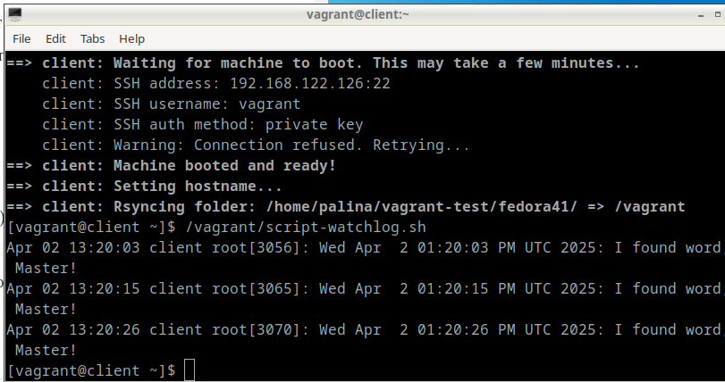
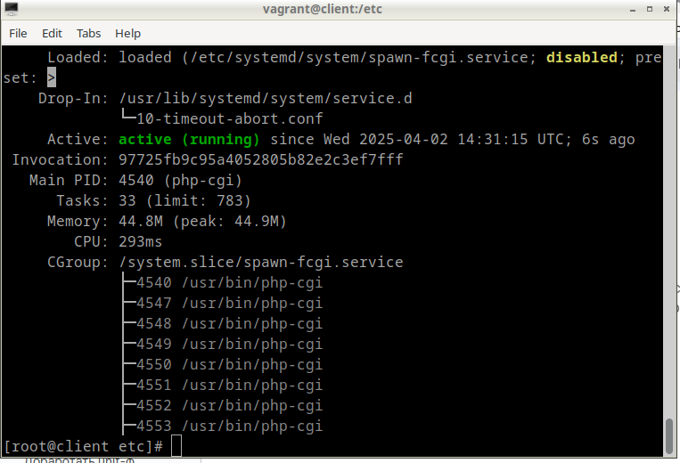
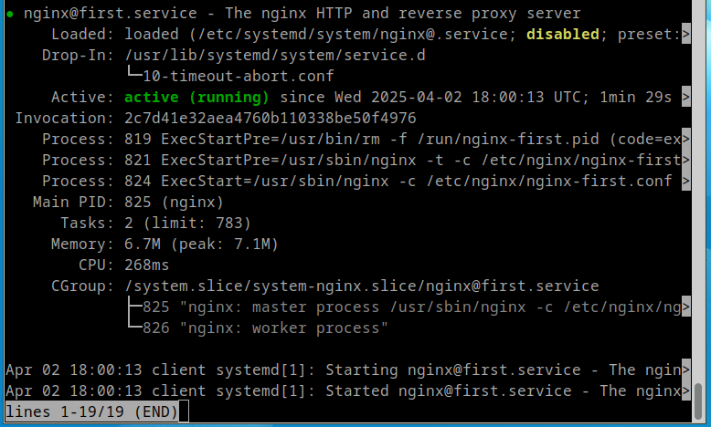
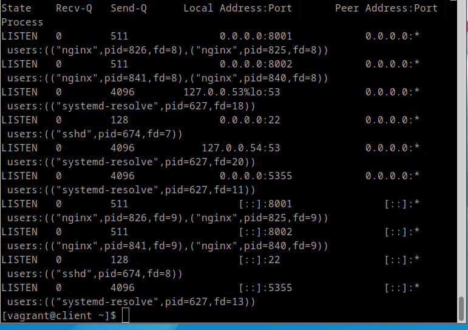

# Домашнее задание по курсу "Administrator Linux. Professional"

**Название задания:** 

  - Systemd - создание unit - файла 

**Текст задания:** 

  1. Написать ```service```, который будет раз в 5 секунд мониторить лог на предмет наличия ключевого слова ```ALERT```.

  2. Установить ```spawn-fcgi``` и создать unit-файл ```spawn-fcgi.sevice```.

  3. Доработать unit-файл ```Nginx``` (nginx.service) для запуска нескольких инстансов сервера с разными конфигурационными файлами одновременно.

**Реализация:**

  - VM Fedora 41, среда выполнения:Vagrant + libvirt. 
  - Сервер поднимается через Vagrantfile,
  - Написано по скрипту для выполнения каждого задания, скрипты нужно запустить на виртуальной машине

## 1. Написание сервиса, который будет мониторить лог каждые 5 минут на наличие ключевого слова

  - поднимаем сервер:
    
```
vagrant up && vagrant ssh
```

  - запускаем первый скрипт, который копирует все необходимые конфиги и запускает демон:

```
/vagrant/script-watchlog.sh
```

  - видим результат:




## 2. Устанавливаем ```spawn-fcgi``` и создаём unit-файл ```spawn-fcgi.sevice```.

  - запускаем второй скрипт, который загружает дополнительный репозиторий, копирует все необходимые конфиги и запускает демон:

```
/vagrant/script-swapn-fcgi.sh
```

  - видим результат:



## 3. Создание unit-файла ```Nginx``` (nginx@.service) для запуска нескольких инстансов сервера с разными конфигурационными файлами одновременно.

  - запускаем треттий скрипт, который устанавливает nginx, копирует все необходимые конфиги, отключает SELinux и перезагружает систему:

```
/vagrant/script-nginx.sh
```

  - дожидаемся окончательной перезагрузки, заходим на сервер и запускаем скрипт для проверки:

```
vagrant ssh
check-nginx.sh
```

  - видим результат:




